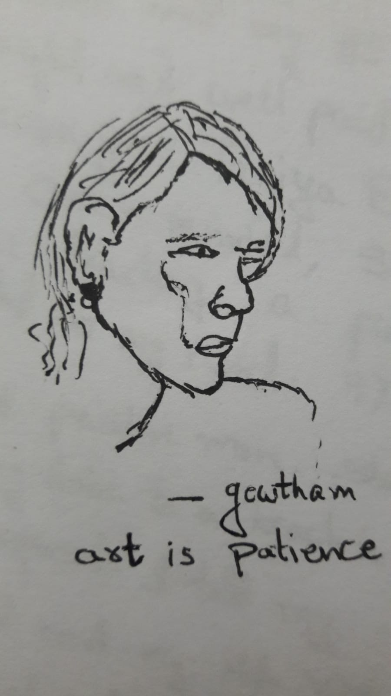

I wanna admire you in some way, so I chose to sketch your pictures. Because "Beauty not admired is a sin". They might look creepy, but trust me, I'll get better.

That's just a first trial. It'll be even better next time.

 

How are you? How are your parents? and howz ur family? I don't know if you already know about this Pulse Oximeter, if not it's better to have one at home. It’s important to keep a constant check on your Oxygen levels. Also, tell your parents 
